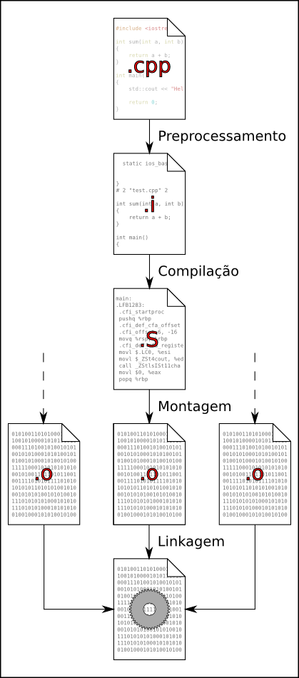

O processo de compilação
========================

Agora que vimos um programa simples, precisamos ser capazes de gerar um
executável para vê-lo em ação. Iremos então entender como esse processo ocorre,
passo a passo.


Compilando um programa simples
------------------------------

Para compilarmos o nosso programa `age.cpp`, iremos utilizar o seguinte comando:

```
g++ -o age age.cpp
```

Este comando irá gerar um executável chamado `age` a partir do nosso código.
Ao executá-lo, veremos a seguinte saída:

```bash
$ g++ -o age age.cpp
$ ./age
Hello, Tarcísio. I see you were born in 1993!
```


Os estágios de compilação
-------------------------
Um programa em C++ passa por pelo menos 5 estágios durante sua compilação,
detalhados a seguir.


### Preprocessamento

O primeiro estágio é o **preprocessamento**. Esse estágio na realidade vem
antes da compilação propriamente dita: o preprocessador é um programa de
manipulação de texto que não leva em consideração a linguagem em que o código
está escrito.  Ele apenas manipula texto de acordo com diretivas que vemos no
código iniciando com `#`, como `#include` ou `#ifndef`.  Para observar o
resultado do preprocessamento, pode-se utilizar o comando `cpp` (C
Preprocessor), ou `g++ -E`.

Estes comandos jogarão o resultado para a saída padrão. Para gerar um arquivo
com a saída, usamos a opção `-o`. A extensão mais comum para arquivos já
preprocessados é `.i` (porém, não é muito comum que estes arquivos sejam vistos
pelo programador).

```
cpp age.cpp -o age.i
```

```
g++ -E age.cpp -o age.i
```

Se você abrir o arquivo resultante, verá que ao final de uma grande quantidade
de linhas, há o conteúdo do nosso código, exceto pelas diretivas `#include`,
que foram substituídas pelo conteúdo dos cabeçalhos da biblioteca padrão:

```cpp
// (...) Grande trecho de código da biblioteca padrão
# 2 "src/lesson_1/age.cpp" 2


# 4 "src/lesson_1/age.cpp"
int main()
{
    int year = 2019;
    int age = 26;
    std::string name = "Tarcísio";
    std::cout << "Hello, " << name
              << ". I see you were born in "
              << year - age << "!\n";
}
```


### Compilação

Na sequência ocorre o passo que chamamos **compilação** propriamente dita: o
código em C++ é compilado para  _assembly_, ou **linguagem de montagem**.
Podemos observar este estágio utilizando a opção `-S` com o `g++`. Novamente
a saída é dada na saída padrão. Para gerar um arquivo, utilizamos a opção `-o`.

```
g++ -S age.cpp -o age.S
```

ou, partindo de onde paramos antes

```
g++ -S age.i -o age.S
```

A linguagem de montagem depende do tipo de processador para o qual estamos
compilando (geralmente x86\_64) e tem mais ou menos a seguinte forma:

```assembly
(...)
.LC0:
	.string	"Tarc\303\255sio"
.LC1:
	.string	"Hello, "
.LC2:
	.string	". I see you were born in "
.LC3:
	.string	"!\n"
	.text
	.globl	main
	.type	main, @function
main:
.LFB1493:
	.cfi_startproc
	.cfi_personality 0x9b,DW.ref.__gxx_personality_v0
	.cfi_lsda 0x1b,.LLSDA1493
	pushq	%rbp
	.cfi_def_cfa_offset 16
	.cfi_offset 6, -16
	movq	%rsp, %rbp
	.cfi_def_cfa_register 6
	pushq	%rbx
	subq	$72, %rsp
	.cfi_offset 3, -24
	movq	%fs:40, %rax
	movq	%rax, -24(%rbp)
	xorl	%eax, %eax
	movl	$2019, -72(%rbp)
	movl	$26, -68(%rbp)
	leaq	-73(%rbp), %rax
	movq	%rax, %rdi
	call	_ZNSaIcEC1Ev@PLT
	leaq	-73(%rbp), %rdx
	leaq	-64(%rbp), %rax
	leaq	.LC0(%rip), %rsi
	movq	%rax, %rdi
.LEHB0:
	call	_ZNSt7__cxx1112basic_stringIcSt11char_traitsIcESaIcEEC1EPKcRKS3_@PLT
.LEHE0:
	leaq	-73(%rbp), %rax
	movq	%rax, %rdi
	call	_ZNSaIcED1Ev@PLT
	leaq	.LC1(%rip), %rsi
	leaq	_ZSt4cout(%rip), %rdi
(...)
```

### Montagem

Neste passo o _assembly_ é **montado**, gerando código de máquina binário. Isto
gera o código que chamamos _object code_ ou **código objeto**. Para
visualizarmos este passo temos a opção `-c`.

```
g++ -c age.cpp -o age.o
```

ou partindo do ponto anterior

```
g++ -c age.S -o age.o
```

Perceba que se abrirmos o código objeto num editor de texto comum vemos diversos
caracteres estranhos: o formato agora é binário, e não textual. Podemos ver o
conteúdo do arquivo de forma mais legível com o comando `objdump -CD` (sugestão:
jogue a saída para o comando `less` para poder navegar, pois a saída é grande).

```
objdump -CD main.o | less
```

A flag `-C` é especial para C++ e faz com que nomes sejam mostrados como no
código, com namespaces corretos e afins. Na saída do `objdump` conseguimos
ver o código binário como hexadecimal à esquerda, e o _assembly_ correspondente
à direita.

```
(...)
Disassembly of section .text:

0000000000000000 <main>:
   0:   55                      push   %rbp
   1:   48 89 e5                mov    %rsp,%rbp
   4:   53                      push   %rbx
   5:   48 83 ec 48             sub    $0x48,%rsp
   9:   64 48 8b 04 25 28 00    mov    %fs:0x28,%rax
  10:   00 00
  12:   48 89 45 e8             mov    %rax,-0x18(%rbp)
  16:   31 c0                   xor    %eax,%eax
  18:   c7 45 b8 e3 07 00 00    movl   $0x7e3,-0x48(%rbp)
  1f:   c7 45 bc 1a 00 00 00    movl   $0x1a,-0x44(%rbp)
  26:   48 8d 45 b7             lea    -0x49(%rbp),%rax
  2a:   48 89 c7                mov    %rax,%rdi
  2d:   e8 00 00 00 00          callq  32 <main+0x32>
  32:   48 8d 55 b7             lea    -0x49(%rbp),%rdx
  36:   48 8d 45 c0             lea    -0x40(%rbp),%rax
  3a:   48 8d 35 00 00 00 00    lea    0x0(%rip),%rsi        # 41 <main+0x41>
  41:   48 89 c7                mov    %rax,%rdi
  44:   e8 00 00 00 00          callq  49 <main+0x49>
  49:   48 8d 45 b7             lea    -0x49(%rbp),%rax
  4d:   48 89 c7                mov    %rax,%rdi
  50:   e8 00 00 00 00          callq  55 <main+0x55>
  55:   48 8d 35 00 00 00 00    lea    0x0(%rip),%rsi        # 5c <main+0x5c>
  5c:   48 8d 3d 00 00 00 00    lea    0x0(%rip),%rdi        # 63 <main+0x63>
  63:   e8 00 00 00 00          callq  68 <main+0x68>
  68:   48 89 c2                mov    %rax,%rdx
  6b:   48 8d 45 c0             lea    -0x40(%rbp),%rax
  6f:   48 89 c6                mov    %rax,%rsi
  72:   48 89 d7                mov    %rdx,%rdi
  75:   e8 00 00 00 00          callq  7a <main+0x7a>
  7a:   48 8d 35 00 00 00 00    lea    0x0(%rip),%rsi        # 81 <main+0x81>
  81:   48 89 c7                mov    %rax,%rdi
(...)
```


### Linkagem

O processo final de geração do executável é a **linkagem** (que admitidamente
não é um verbo real em português). Neste passo, os códigos objeto de todas as
unidades de tradução envolvidas no programa são unidos em um só. Como no momento
estamos trabalhando com programas de apenas um arquivo, revisitaremos a linkagem
adiante quando trabalharmos com código dividido em mais de um arquivo.

Para finalizarmos a geração de nosso executável, basta rodar:

```
g++ -o age age.o
```

Será gerado um executável de nome `age`, que é o mesmo programa que geramos com
o comando `g++ -o age age.cpp `. Neste exemplo bastante simples, isso tudo
parece uma complicação desnecessária, e realmente é. De fato, no dia-a-dia,
exceto o comando `g++ -c` para gerar código objeto, os outros não costumam ser
utilizados com frequência.  Em programas maiores, porém, com processos de
compilação mais complexos, com diversos arquivos, e principalmente, em que nem
todos os .cpp estão no mesmo diretório, a geração de código objeto
intermediária é importante e bastante comum.


Diagrama
--------
Por fim, para uma visualização mais "gráfica", temos aqui um diagrama. Este
diagrama já presume um programa dividido em diversos arquivos.

<center>
  <figure class="image">
    
    <figcaption>Diagrama do processo de geração de um executável</figcaption>
  </figure>
</center>
